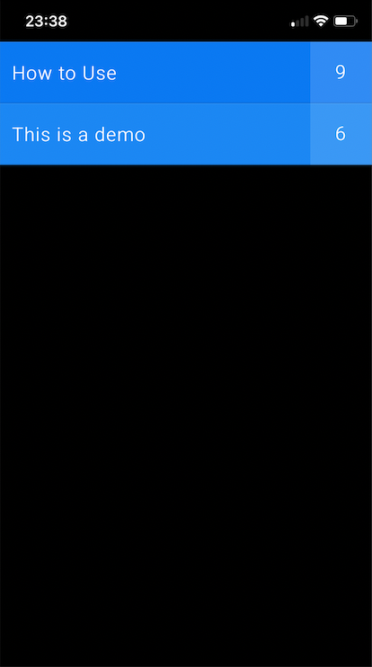
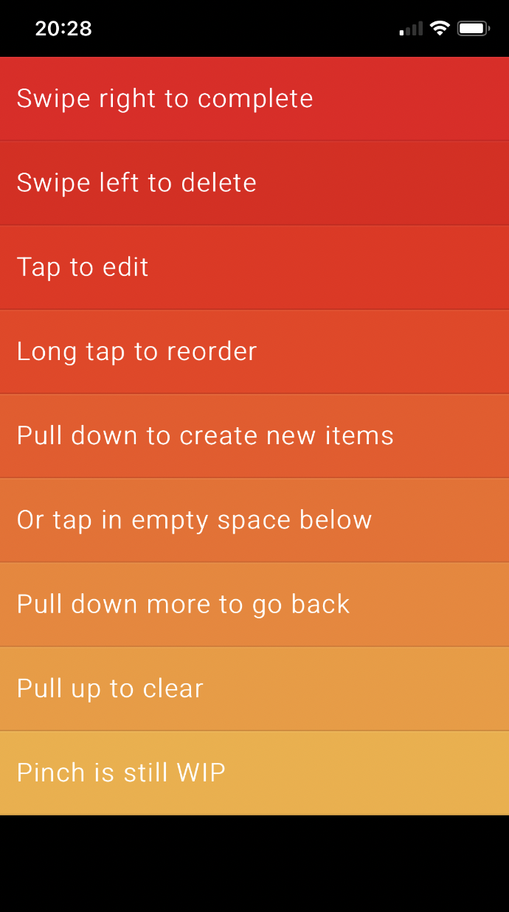

# Clear Todo

This is a re-modification of the archived project made by Evan You (Creator of Vue). The original iOS todo app 'Clear' can be downloaded from Apple's App Store. The main idea is to use web technologies to clone the gesture control experience. Users can use gestures to create, complete, delete, and manage todo events. This clone project is written in HTML5, CSS3, and vanilla JavaScript with ES6 features and OOD class concepts.

Live site: https://zhao-zihan.github.io/html-clear-clone/

Add #debug at the end of the url to enter debug mode if you get stuck

example: https://zhao-zihan.github.io/html-clear-clone/#debug

## Gesture controls implemented:

- Swipe right to complete
- Swipe left to delete
- Tap to edit
- Long tap to reorder
- Pull down to create new items
- Tap in empty space to create new items
- Long pull down / up to go back and forth
- Long pull up to clear done items

## Screenshot:

